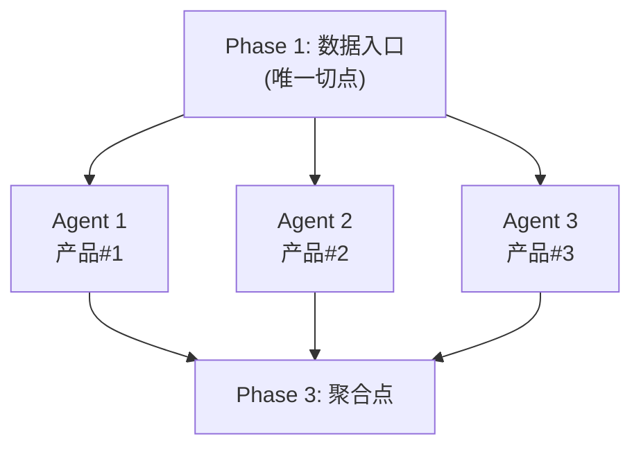

# Agent 并行架构

## 定义

基于 Palantir AIP 第一性原理，将多步骤复杂任务拆分为多个独立 Agent 并行执行的架构模式。通过 **依赖拓扑分析** 判定最佳拆分节点，以最小协调成本达成最大并行度。

## 核心命题

> 多步骤任务应该由一个 Agent 串行执行，还是拆成多个 Agent 并行？

## 判定法则 — 依赖拓扑分析法



| 判断条件 | 串行 | 并行 |
|---------|------|------|
| 子任务之间有数据依赖 | ✅ 必须 | ❌ 不可 |
| 子任务之间零依赖且各自独立 | ❌ 浪费 | ✅ 应该 |
| 子任务需要一致性闭环（如标题↔卖点↔主图） | ✅ 绑在同一Agent | ❌ 拆开增加拼接成本 |

## 两种拆分方案实证

### 实验设计

5 个产品 × 3 项产出（标题 + 卖点 + 主图）= 15 个任务单元

### 架构对比

| 架构 | 并行度 | 墙钟时间 | 协调成本 | 一致性 |
|------|--------|---------|---------|--------|
| A. 单Agent串行 | 0 | ~300s | 零 | ✅ 强 |
| B. 按任务类型拆3 Agent | 3路 | ~120s | 高（需主Agent缝合标题↔卖点↔主图） | ⚠️ 弱 |
| **C. 按产品拆5 Agent** ⭐ | 5路 | **~60s** | 低（每Agent自闭环） | ✅ 强 |

### 结论

**按「产品」拆分的 Agent 架构同时达成最高并行度、最低协调成本和最强一致性。** 这一发现在 2026-05-19 通过 LILIS 5 产品流水线实际验证。

## 3-Phase 流水线模板

```
Phase 1 (主Agent串行)      Phase 2 (N Agent并行)          Phase 3 (主Agent聚合)
┌──────────────┐        ┌─────────────────────┐        ┌──────────────┐
│ 数据筛选+结构化 │   ──→  │ Agent 1..N 同时启动    │   ──→  │ 一致性检查   │
│ 输出JSON文件   │        │                     │        │ 汇总报告     │
└──────────────┘        │ 每个Agent入参独立      │        └──────────────┘
                        │ 每个Agent输出独立文件  │
                        └─────────────────────┘
```

### 阶段说明

| 阶段 | 执行者 | 耗时 | 产出 |
|------|--------|------|------|
| Phase 1 | 主 Agent | 2-5 min | 结构化 JSON（候选池） |
| Phase 2 | 5 个并行 Agent | ~60s 墙钟 | 5 个独立输出文件 |
| Phase 3 | 主 Agent | 1-2 min | 一致性报告 + 汇总 |

## 适用范围

- N 个独立产品/实体 × M 项产出的流水线作业
- N 可线性扩展（5→50 产品）
- 适用场景：产品改造、批量文案生成、SEO 重构、多平台同步

## 关键约束

| 约束 | 说明 |
|------|------|
| 切分点唯一 | Phase 1 的结构化 JSON 是唯一分发点，不可在更早或更晚处切 |
| 一致性闭环 | 同一产品的多维度产出（标题+卖点+主图）必须绑在同一 Agent |
| 入参独立 | 每个 Agent 的输入必须是独立可读的，不依赖其他 Agent 输出 |
| 聚合验证 | Phase 3 必须做完整一致性检查（维度×产品数） |

## 业务应用

### LILIS 每日上品工作流

![[新品工作流效率模型]]

- Phase 1: 数据参谋导出 → AI 筛选 5 个普通品候选
- Phase 2: 5 Agent 各自完成标题(128字符) + 卖点(2000字符) + 主图
- Phase 3: 一致性验证 → 汇总报表 → 人工确认

**效率对比**: 日耗时从 120 min → **55 min**，纯 AI 部分从 300s → **60s**（↓80%）

## 相关链接

- [[AIP总览]]
- [[Sense-Reason-Act架构]]
- [[新品工作流效率模型]]
- [[SEO重构工作流v1]]
- [[LILIS每日清单]]
- [[Palantir_AIP_Wiki#15. AIP-Derived Agent 并行架构|Wiki 原文]]
- [[主页]]
- [[术语索引]]
