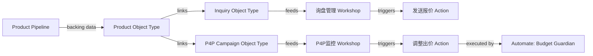

# Automate 与工作流工具

## 定义

本页面覆盖 Foundry 的**工作流构建与管理工具**四件套：Automate（自动化引擎）、Workflow Lineage（工作流可视化）、Solution Designer（架构设计 + AIP Architect）、Use Cases → Portfolios（项目组织）。这些工具共同构成"从设计到实现到监控"的完整工作流管理链。

## 1. Automate — 业务自动化引擎

### 定义

Automate 是 Foundry 平台所有**业务自动化**的单一入口，取代了之前的 Object Monitoring。它提供声明式的**条件→效果**模型，持续检查条件并在满足时自动执行效果。

### 条件体系

| 条件类型 | 检查方式 | 典型场景 |
|---------|---------|---------|
| **Time-based** | 按 Cron 表达式或固定间隔 | "每天 9AM"、"每 2 小时" |
| **Object Data** | 监听 Ontology 对象集变化 | "新增 high priority Alert" |
| **Time + Object 组合** | 时间调度 + 对象条件联合 | "每小时检查 + 高优先级队列非空" |
| **Streaming 条件** | 流式数据实时触发（低延迟） | 实时传感器告警 |

条件通过 Object Set 筛选或自定义过滤定义哪些对象变化会触发自动化。

### 效果体系

| 效果类型 | 说明 | 示例 |
|---------|------|------|
| **Action effects** | 对 Ontology 对象的 CRUD 操作 | 批量关闭过期 Alert |
| **Logic effects** | 执行 AIP Logic 函数 | AI 分析 Alert 内容 → 分类 |
| **Function effects** | 执行 TypeScript/Python 函数 | 调用外部 API 获取数据 |
| **Notification effects** | 发送通知给用户/组 | Slack/Email 通知运营人员 |
| **Fallback effects** | 主效果失败时执行 | 失败 → Log + 通知管理员 |

**执行设置**：
- **并发模式**：效果顺序执行或并行执行
- **对象编辑处理**：控制多次编辑的合并策略
- **至少一次执行保证**：效果保证至少执行一次，但不保证恰好一次

**性能最佳实践**：
- 精确配置条件（减少不必要触发）
- 选择合适的执行模式
- 设计简洁的效果链

### Automate 使用场景

| 场景 | 条件 | 效果 |
|------|------|------|
| 数据质量监控 | 新增对象中必填字段为空 | Action: 标记为待审核 + Notification |
| 库存预警 | 库存 < 阈值 | Notification: Slack + Logic: 生成补货建议 |
| 客户流失预警 | 客户最后活跃 > 90天 | Action: 标记风险 + Function: 发送挽回邮件 |
| 定时报告 | Time: 每周一 9AM | Logic: 生成周报 + Notification: 发送 |

## 2. Workflow Lineage — 工作流可视化与调试

### 定义

Workflow Lineage（原名 Workflow Builder）提供交互式工作空间来理解、管理和调试跨 Ontology 资源的工作流。

### 核心能力

**溯源图（Provenance Graph）**：可视化跨 Ontology 的关系——Object Types / Interfaces / Action Types / Functions / LLM Models / Applications 之间的依赖关系。

**深层属性溯源**：探究单个属性数据来源（哪个 Pipeline？哪个数据集？哪个 Transform？）

**Widget/Variable 溯源**：Workshop 内部——Widget 绑定哪些 Variable？Variable 从哪来？去哪？

**升级工具**：批量重构 Function 或 Action——Workflow Lineage 直接应用到 AIP Logic 函数，**无需提案或审批步骤**。

**Global Branching 支持**：在分支中检验变更，确认后再合并到主分支。

**AIP Observability**：查看执行历史、分布式追踪、调试 AIP 工作流。

## 3. Solution Designer — 架构设计

### 定义

Solution Designer 让架构师创建 Palantir 解决方案的**架构表示图**。可从空白画布或现有数据血缘图开始。

**架构图元素**：对象类型 / 应用 / 数据流 / 依赖关系 / 外部系统。

**AIP Architect 插件**：将工作流需求 → LLM 生成的 Implementation Plan → Walkthrough 步骤引导实现。

**AIP Architect 工作流**：
```
输入需求描述
     ↓
LLM 分析 + 生成 Workflow Plan
     ↓  (Implementation Plan 侧边栏)
Save and Start Building
     ↓
AIP Architect Walkthrough（逐步引导）
     ↓
在 Workshop / Automate / Functions 中构建实际工作流
```

## 外贸应用

### LILIS Automate 等效

| Automate 能力 | LILIS 等效实现 | 工具栈 |
|-------------|-------------|--------|
| Time Condition | cron 定时任务 | cron + Python script |
| Object Data Condition | Alibaba API Polling | Python + Alibaba API |
| Action Effect | API Write | Alibaba API + requests |
| Logic Effect | AI Classification | GPT API + Python |
| Function Effect | Lambda / GCF | AWS Lambda / GCP Cloud Functions |
| Notification Effect | Slack / Email | Slack SDK / smtplib |
| Fallback Effect | Error Handler | try-except + alert |

### LILIS 自动化工作流示例

**P4P Budget Guardian**：
```
Condition: Time-based — "Every 3 hours" (Object Data 弥补: Alibaba API Polling)
Effects:
  1. Function: 调用 Alibaba API → 获取各 Campaign 预算
  2. Logic: 检查消耗率 → 分类 (正常/警告/紧急)
  3. Action: 
     - 紧急(>95%): 暂停 Campaign + Notification: Slack
     - 警告(>80%): Notification: 运营群
     - 正常: Log Only
  4. Fallback (以上任何步骤失败): Log 错误 + Notification: 管理员
```

**询盘自动分流**：
```
Condition: Object Data — "新询盘到达"
Effects:
  1. Logic (AIP Logic 等效): GPT 分类 → 询盘类型 + 优先级
  2. Action: 标记 Inquiry.status + Inquiry.priority
  3. Notification: 高优先级 → 即时通知销售
```

### LILIS Workflow Lineage 等效

用 Mermaid.js 或 Dag 可视化工具构建运营工作流溯源图：


## 常见问题

**Q: Automate 和 Functions 有什么区别？**
A: Automate 是"编排层"（何时触发），Functions 是"执行层"（执行什么逻辑）。一个 Automate 可以触发多个 Effects（包括 Functions）。

**Q: Workflow Lineage 的 Global Branching 如何工作？**
A: 在分支中修改 Function/Application → Workflow Lineage 显示分支版本的溯源图 → 验证 → 合并到主分支。

**Q: AIP Architect 能自动生成完整工作流吗？**
A: 它生成 Implementation Plan + Walkthrough 引导，但实际构建仍需人工在 Workshop/Automate 中完成。它是"引导者"而非"全自动构建者"。

**Q: Solution Designer 的图能嵌入到 Notepad 吗？**
A: 可以——Notepad 有 Solution Designer Diagram Widget（只读视图）。

## 相关链接
- [[应用构建总览]] — 完整 App Building 生态
- [[Workshop构建深度]] — Workshop Events/Variables/Layouts
- [[Ontology深度总览]] — Automations 在 Ontology 中的角色
- [[动力层与写回]] — Actions 详解
- [[开发者工具链总览]] — Functions 执行引擎
- [[Data-Health与告警]]
- [[LILIS-AIP方法论-中小卖家AI增效实战手册]]
- [[Observability总览]]
- [[主页]]
- [[术语索引]]
